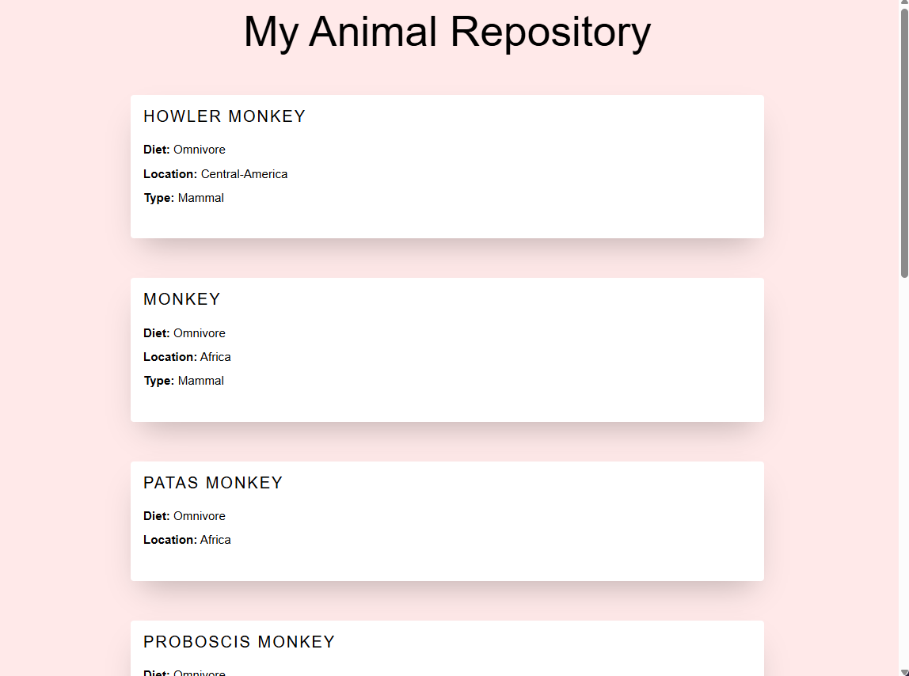

# ANIMAL API SEARCH

This project searches the https://api-ninjas.com/api/animals api for animal data. 
It will then generate the results as an html website. See the example below for the search: _Monkey_.

## Installation

To install this project, simply clone the repository and install the dependencies in requirements.txt using 
`pip install -r /path/to/requirements.txt`

## Usage

To use this project, run the following command -`python animals_web_generator.py`.